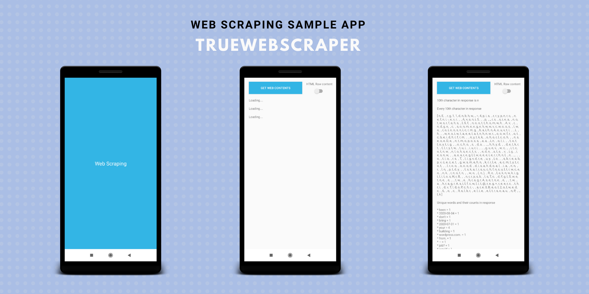

<p align="center">
 <center></a></center>
</p>

# TrueWebScraper
[](https://www.android.com)
[](LICENSE)


This is a sample Android application 📱 built to demonstrate use of *Web Scraping in Android apps*. Dedicated to all Android Developers with ❤️. 

***You can Install and test latest app from below 👇***

[](https://github.com/happysingh23828/TrueWebScraper/raw/master/files/TrueWebScraper.apk)


## - About
This app simply get the contents of [this webpage](https://truecaller.blog/2018/01/22/life-as-an-android-engineer/). There are three functionality which are being implemented in this app.
 * Get first nth character. 
 * Get every nth character of the content.
 * Get uniques words with their occurence counts.
 * Switch button is given to differentiate between scraping the raw html/javascript or plain readable text [it uses jsoup to convert html to doc].

## - Built With 🛠
- [Kotlin](https://kotlinlang.org/) - First class and official programming language for Android development.
- [Rx-Java](https://github.com/ReactiveX/RxJava) - For composing asynchronous and event-based programs by using observable sequences.
- [Android Architecture Components](https://developer.android.com/topic/libraries/architecture) - Collection of libraries that help you design robust, testable, and maintainable apps.
  - [ViewModel](https://developer.android.com/topic/libraries/architecture/viewmodel) - Stores UI-related data that isn't destroyed on UI changes. 
- [Retrofit](https://square.github.io/retrofit/) - A type-safe HTTP client for Android and Java.
- [OkHttp](http://square.github.io/okhttp/) - HTTP client that's efficient by default: HTTP/2 support allows all requests to the same host to share a socket.
- [Jsoup](https://jsoup.org/) - Provides a very convenient API for fetching URLs and extracting and manipulating data, using the best of HTML5 DOM methods and CSS selectors.

## - Modules of App
  ### App 
  It uses the all the components and class releated to Android Framework. It has activity, viewmodel and base classes.
  
  ### BuildSrc
  This module helps to list and manage all the dependencies of the app at one place. It has list of dependencies and versions of that dependencies.
  
  ### Remote
  The Remote layer handles all communications with remote sources, in our case it makes a simple API call using a Retrofit interface. 
  
  ### ContentScraper
  This module is resusable for kotlin multiplatform support as it is having pure kotlin code. It has two public API interfaces.
* [ContentScraper](https://github.com/happysingh23828/TrueWebScraper/blob/master/ContentScraper/src/main/java/com/androchef/contentscraper/ContentScraper.kt) - It will take one string as input and perform some scraping actions on it. 
* [RemoteContentScraper](https://github.com/happysingh23828/TrueWebScraper/blob/master/ContentScraper/src/main/java/com/androchef/contentscraper/RemoteContentScraper.kt) - It will take one web url and will be preforming actions on web page content.

## Why I have used multimodule approch?.
* Clear isolation between code. so it will be easy to reuse.
* We can make subprojects out of this approch. [ **eg:** : you can reuse ContentScraper for any android app or for kotlin multiplatform]
* No fragile and rigidity code , so it will be easy to maintain and scale.
 
## - Current App's Architecture
This app uses [***MVVM (Model View View-Model)***](https://developer.android.com/jetpack/docs/guide#recommended-app-arch) architecture.

## - Future Plans
1. Add more unit test cases. 
2. Use dependency injection etc.

## If this project helps you in anyway, show your love :heart: by putting a :star: on this project :v:


## - Contributing

Please fork this repository and contribute back using
[pull requests](https://github.com/happysingh23828/TrueWebScraper/pulls).

Any contributions, large or small, major features, bug fixes, are welcomed and appreciated
but will be thoroughly reviewed .

### - Contact - Let's become friend
- [Androchef Blog](https://androchef.com/)
- [Androchef Youtube](https://www.youtube.com/channel/UCILhpbLSFkGzsiCYAeR30DA)
- [Github](https://github.com/happysingh23828)
- [Linkedin](https://www.linkedin.com/in/happpysingh23828/)

## - License

```
MIT License

Copyright (c) 2020 Happy Singh

Permission is hereby granted, free of charge, to any person obtaining a copy
of this software and associated documentation files (the "Software"), to deal
in the Software without restriction, including without limitation the rights
to use, copy, modify, merge, publish, distribute, sublicense, and/or sell
copies of the Software, and to permit persons to whom the Software is
furnished to do so, subject to the following conditions:

The above copyright notice and this permission notice shall be included in all
copies or substantial portions of the Software.

THE SOFTWARE IS PROVIDED "AS IS", WITHOUT WARRANTY OF ANY KIND, EXPRESS OR
IMPLIED, INCLUDING BUT NOT LIMITED TO THE WARRANTIES OF MERCHANTABILITY,
FITNESS FOR A PARTICULAR PURPOSE AND NONINFRINGEMENT. IN NO EVENT SHALL THE
AUTHORS OR COPYRIGHT HOLDERS BE LIABLE FOR ANY CLAIM, DAMAGES OR OTHER
LIABILITY, WHETHER IN AN ACTION OF CONTRACT, TORT OR OTHERWISE, ARISING FROM,
OUT OF OR IN CONNECTION WITH THE SOFTWARE OR THE USE OR OTHER DEALINGS IN THE
SOFTWARE.```
